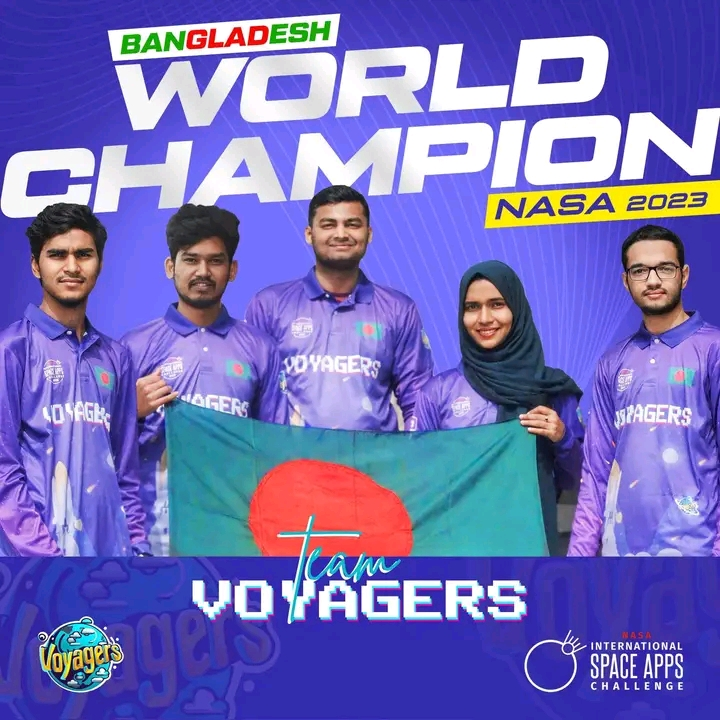

<!DOCTYPE html>
<html lang="en">
<head>
    <meta charset="UTF-8">
    <meta name="viewport" content="width=device-width, initial-scale=1.0">
    <title>Mst. Fahmida Akter - CSE Student & Frontend Designer</title>
    
    <!-- Google Fonts: Poppins -->
    <link rel="preconnect" href="https://fonts.googleapis.com">
    <link rel="preconnect" href="https://fonts.gstatic.com" crossorigin>
    <link href="https://fonts.googleapis.com/css2?family=Poppins:wght@400;500;700&display=swap" rel="stylesheet">

    <!-- Font Awesome for icons -->
    <link rel="stylesheet" href="https://cdnjs.cloudflare.com/ajax/libs/font-awesome/6.1.1/css/all.min.css">

    
</head>
<body>
    <a href="Fahmida_Akter_Resume.pdf" class="download-resume" download aria-label="Download Resume">
        Resume
        <i class="fas fa-download"></i>
    </a>

    <main>
        <section id="intro">
            

                

                    
                

                

                    <h2>Hello!</h2>
                    <h1>I'm Mst. Fahmida Akter</h1>
                    

                    
I’m a Computer Science & Engineering student with a strong passion for frontend design, UI/UX, and research. I bring a solid foundation in leadership, dedicated to inspiring and guiding teams toward meaningful goals. Through my academic and professional experiences, I strive to make a positive impact by fostering collaboration and innovation.

                    

                        <a href="https://www.linkedin.com/in/mst-fahmida-akter/" target="_blank" aria-label="LinkedIn"><i class="fab fa-linkedin"></i></a>
                        <a href="https://github.com/fahu5" target="_blank" aria-label="GitHub"><i class="fab fa-github"></i></a>
                    

                

            

        </section>

        <section id="skills">
            

                

                    <h2>Skills & Technologies</h2>
                

                

                    

                        <h3>Skills</h3>
                        
C & C++

                        
Python

                        
HTML

                        
CSS

                        
JavaScript

                        
Web Programming

                        
UI/UX Design

                        
Public Speaking

                        
Communication

                        
Leadership

                        
Teamwork

                        
Problem Solving

                        
Research Analysis

                    

                    

                        <h3>Technologies</h3>
                        
C & C++

                        
Python

                        
HTML

                        
CSS

                        
JavaScript

                        
Web Programming

                        
UI/UX Design

                    

                

            

        </section>

       

        <section id="projects">
            

                

                    <h2>My Projects</h2>
                

                

                    

                        

                            <h3>Aqua Explorer</h3>
                            
A game-based water education platform for students.

                            
HTMLCSSJS

                            
<strong>Role:</strong> Research & UI Lead

                        

                    

                    

                        

                            <h3>ScholarlyWay</h3>
                            
A Django-powered scholarship platform to connect students with opportunities.

                            
DjangoSQLiteHTML/CSS

                            
<strong>Role:</strong> Full Stack Developer

                        

                    

                    

                        

                            <h3>NASA Space App Project</h3>
                            
A global winning solution for the NASA Space Apps Challenge.

                            
ResearchTeam-Lead

                            
<strong>Role:</strong> Team Lead & Researcher

                        

                    

                

            

        </section>

         <section id="resume">
            

                

                    <h2>Resume</h2>
                

                

                    

                        <h3>Education</h3>
                        

                            
<i class="fas fa-graduation-cap"></i>

                            

                                <h4>B.Sc. in Computer Science & Engineering</h4>
                                
Varendra University

                                2022–Present | CGPA: 3.92
                            

                        

                        

                            
<i class="fas fa-graduation-cap"></i>

                            

                                <h4>Higher Secondary Certificate (HSC)</h4>
                                
Rajshahi Govt. Women’s College

                                GPA: 5.00
                            

                        

                        

                            
<i class="fas fa-graduation-cap"></i>

                            

                                <h4>Secondary School Certificate (SSC)</h4>
                                
Rajshahi Cantonment Board School

                                GPA: 5.00
                            

                        

                    

                    

                        <h3>Co-Curricular Activities</h3>
                        

                            
<i class="fas fa-star"></i>

                            

                                <h4>Co-Convenor</h4>
                                
BASIS Students’ Forum - Varendra University Chapter

                            

                        

                        

                            
<i class="fas fa-star"></i>

                            

                                <h4>SheSquad Leader</h4>
                                
BDApps

                            

                        

                        

                            
<i class="fas fa-star"></i>

                            

                                <h4>Experts & Judges Support Head</h4>
                                
Hult Prize at Varendra University

                            

                        

                    

                

            

        </section>

        <section id="achievements">
            

                

                    <h2>Achievements</h2>
                

                

                    

                        

                        

                            <h3>Global Winner</h3>
                            
NASA Space Apps Challenge 2023 (Team Voyagers)

                        

                    

                    

                        

                        

                            <h3>Finalist & Honorable Mention</h3>
                            
Blockchain Olympiad 2024 (Team Innovator 4.0)

                        

                    

                    

                        

                        

                            <h3>Campus Champion & NY Semi-Finalist</h3>
                            
Hult Prize 2023 (Team Salvage)

                        

                    

                

            

        </section>

        <section id="certifications">
            

                

                    <h2>Certifications</h2>
                

                

                    

                        

                            <h3>Data Science Math Skills</h3>
                            
Issued by: Coursera (Duke University)

                        

                    

                    

                        

                            <h3>AI for Everyone</h3>
                            
Issued by: Coursera (Andrew Ng)

                        

                    

                    

                        

                            <h3>Frontend Development Basics</h3>
                            
Issued by: Programming Hero

                        

                    

                

            

        </section>

        <section id="contact">
            

                

                    <h2>Get In Touch</h2>
                

                

                    

                        <i class="fas fa-map-marker-alt"></i>
                        <h3>Location</h3>
                        
Rajshahi, Bangladesh

                    

                    

                        <i class="fas fa-envelope"></i>
                        <h3>Email</h3>
                        
222311003@vu.edu.bd

                    

                    

                        <i class="fas fa-phone"></i>
                        <h3>Phone</h3>
                        
+880 1551-806324

                    

                

            

        </section>
    </main>

    <footer>
        

            
© 2024 Mst. Fahmida Akter

        

    </footer>

    
</body>
</html>
